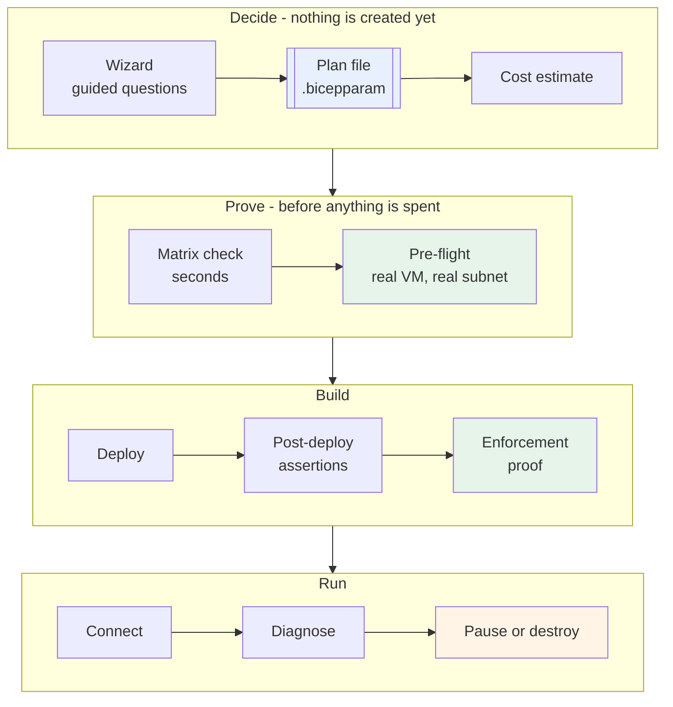
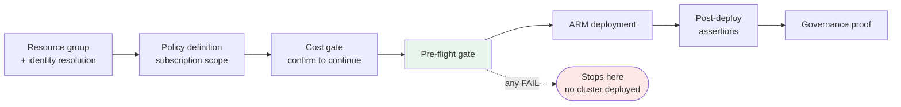
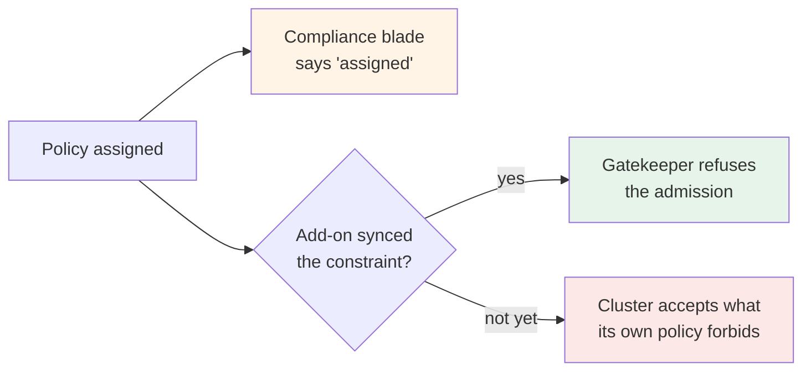

# Guided walkthrough

A suggested order for working through this repository, whether you are evaluating it, handing it to
a team, or standing up your first cluster. Every command is runnable as written; substitute your own
resource group names and region.

Nothing here assumes a pre-existing environment. Where a step needs a deployed cluster, it says so.



### Steps at a glance

| Step | Purpose | Azure needed | Creates resources |
| --- | --- | --- | --- |
| [0. Before you start](#0-before-you-start) | Tools and subscription | Login | No |
| [1. Start with the wizard](#1-start-with-the-wizard) | Turn decisions into a plan file | No | No |
| [2. The matrix is enforced](#2-the-matrix-is-enforced-not-advisory) | Reject unsupported combinations in seconds | No | No |
| [3. Price it](#3-price-it-before-you-commit) | Itemised estimate before committing | No | No |
| [4. Pre-flight](#4-pre-flight--the-highest-value-part) | Test the real network path | Yes | One throwaway VM, then deleted |
| [5. Deploy](#5-deploy) | Build it, with gates | Yes | Yes |
| [6. Compare egress models](#6-compare-the-egress-models-on-live-resources) | See the difference on live resources | Yes | No |
| [7. Governance](#7-governance--assignment-then-proof) | Prove the rules actually refuse things | Yes | A namespace, torn down |
| [8. Connecting](#8-connecting) | `kubectl`, public and private | Yes | No |
| [9. When something fails](#9-when-something-fails) | Collect evidence | Yes | No |
| [10. Stop the meter](#10-stop-the-meter-or-tear-it-down) | Pause or tear down | Yes | Removes |

---

## 0. Before you start

| Requirement | Check |
| --- | --- |
| Azure CLI 2.60+ | `az version` |
| Bicep | `az bicep version` (`az bicep install` if missing) |
| `jq` | `jq --version` — the scripts and the Makefile require it |
| PowerShell 7 *or* bash | Every script ships as a matched pair; use whichever you have |
| An Azure subscription you can create resource groups in | `az account show` |
| Rights to create role assignments | Owner or User Access Administrator. Pre-flight verifies this for you. |

Pick a subscription and stay in it:

```bash
az login
az account set --subscription "<your-subscription>"
```

You do **not** need to set any `AKS_*` environment variables to get started — the wizard collects
everything it needs and writes it down for you.

---

## 1. Start with the wizard

```bash
make wizard          # or ./scripts/wizard.sh, or ./scripts/wizard.ps1
```

This is the recommended entry point, and not because it saves typing. The settings that matter most
in AKS — the egress model, the network plugin, the Service CIDR, whether the API server is public —
**cannot be changed on a running cluster**. They are chosen in the first ten minutes, usually by
someone who has not yet been told which of them are permanent. The wizard puts the guidance at the
point of decision.

For each question it states three things: the minimum that works, what Microsoft recommends, and
what this repository recommends for your situation — including why those sometimes differ. Pressing
Enter always takes the recommendation.

It ends by writing a real parameter file into `infra/params/`, compiling it, pricing it, and asking
whether to deploy. It does not deploy anything itself: it hands the plan to `deploy.sh --param-file`,
so the pre-flight gate, the cost gate and the post-deployment checks all apply exactly as they would
to a curated architecture.

Add `--plan-only` to produce and price a plan without deploying it — useful for getting a change
approved before spending anything.

> The generated file is the artifact worth keeping. It is a complete, diffable description of the
> cluster, and re-running `deploy` against it reproduces the same environment.

If you would rather understand the choices before being asked about them, read the decision table in
[README.md](README.md) and [docs/architectures.md](docs/architectures.md) first, then come back.

Full detail: [docs/wizard.md](docs/wizard.md).

---

## 2. The matrix is enforced, not advisory

Not every combination of architecture, network profile and egress mode works. Rather than documenting that
and hoping, the repository refuses invalid combinations before anything is created.

| Architecture | Network profiles accepted | Egress modes accepted |
| --- | --- | --- |
| `aks-public` | any of the three | any of the three |
| `aks-public-authorized-ip` | any of the three | any of the three |
| `aks-private-link` | any of the three | any of the three |
| `aks-private-vnet-integration` | any of the three | any of the three |
| `aks-automatic` | **`cni-overlay-cilium` only** | any of the three |
| `aks-arc-local` | not applicable | not applicable |
| `arc-attach-existing` | not applicable | not applicable |

The three network profiles are `cni-overlay`, `cni-podsubnet` and `cni-overlay-cilium`; the three
egress modes are `loadbalancer`, `natgateway` and `udr-firewall`. The two Arc architectures run outside an
Azure VNet, so neither setting applies to them.

Ask for something outside that table and you find out immediately:

```bash
./scripts/preflight.sh --architecture aks-automatic --network-profile cni-overlay --location westus3 --skip-live-probe
```
```powershell
./scripts/preflight.ps1 -Architecture aks-automatic -NetworkProfile cni-overlay -Location westus3 -SkipLiveProbe
```

```
[FAIL] architecture.networkProfile   Architecture 'aks-automatic' does not support network profile 'cni-overlay'.
       -> Choose one of: cni-overlay-cilium
```

Exit code 1, in about two seconds, with the accepted values named. AKS Automatic hard-wires Azure CNI
Overlay powered by Cilium; asking for anything else is a decision that would otherwise have surfaced
as a confusing ARM error several minutes into a deployment.

The full matrix lives in [infra/architecture-matrix.json](infra/architecture-matrix.json) and is the single
source of truth — the scripts, the templates and the wizard all read it.

---

## 3. Price it before you commit

```bash
make cost ARCHITECTURE=aks-private-link AKS_COST_TIER=standard
```

Deploys nothing and needs no Azure login. The same itemised estimate appears during `deploy`, which
stops for confirmation if anything expensive is in the plan:

```
!! Azure Firewall (Standard) + 1 public IP          $917 /mo  AKS_EGRESS=natgateway removes it
!! Azure Bastion (Basic)                            $139 /mo  AKS_COST_TIER=lean removes it
!! DNS Private Resolver (2 endpoints)               $360 /mo  AKS_COST_TIER=lean removes it
```

Three cost tiers — `lean` (the default), `standard`, `full` — are named sets of feature toggles in
[infra/params/cost-tiers.json](infra/params/cost-tiers.json). `lean` deploys the architecture's network
pattern and a working cluster and nothing that bills by the hour on top.

Every figure and every knob: [docs/costs.md](docs/costs.md).

---

## 4. Pre-flight — the highest-value part

This is the reason the repository exists. Run it standalone against a subnet:

```bash
./scripts/preflight.sh --param-file infra/params/aks-private-link.bicepparam -g rg-aks-prod -l westus3
```
```powershell
./scripts/preflight.ps1 -ParamFile ./infra/params/aks-private-link.bicepparam -ResourceGroup rg-aks-prod -Location westus3
```

It places a throwaway Linux VM in the intended node subnet, runs [scripts/lib/probe.sh](scripts/lib/probe.sh)
on it, reads Network Watcher effective routes, runs IP-flow-verify, and then deletes the VM —
including on Ctrl-C. On a `udr-firewall` deployment every endpoint check is traversing the Azure
Firewall, which is exactly the path that breaks in practice.

Points worth making to an audience:

- **`path.ipFlow.*` names the exact NSG rule** that allowed or denied the traffic. Not "blocked" —
  the rule.
- **`path.api_server_zone` treats an authoritative NXDOMAIN as healthy.** It is testing whether the
  DNS path resolves, not whether a particular name exists.
- **`path.clock` catches unsynchronised node clocks**, which otherwise surface much later as TLS
  failures that look like certificate problems.
- **The quota check counts maximum autoscale plus 33% upgrade surge**, not current usage. A cluster
  that fits today and cannot upgrade tomorrow is a failure you want to find now.
- **`identity.grantsPlanned` lists every role assignment the deployment will create**, before it
  creates any of them.

> **Read the SKIP lines.** A skipped network-path check means the real path was never tested. A run
> with skips is not a clean run, and the output says so in those words.

Results land in `preflight-<architecture>.json` next to a human-readable table. The JSON is the artifact to
attach to a change record.

`--skip-preflight` exists on `deploy` and prints a warning. Use it knowingly.

---

## 5. Deploy

```bash
./scripts/deploy.sh --architecture aks-private-vnet-integration -g rg-aks-prod -l westus3
```
```powershell
./scripts/deploy.ps1 -Architecture aks-private-vnet-integration -ResourceGroup rg-aks-prod -Location westus3
```

In order:



Preview without changing anything with `--preview` / `-Preview` (an ARM what-if). It is worth
knowing what what-if does *not* catch — see the findings table near the end of this document.

Re-running against an existing environment converges rather than erroring.

---

## 6. Compare the egress models on live resources

Deploy two architectures with different egress modes and put them side by side. Substitute your own
resource group and VNet names (`az network vnet list -g <rg> --query "[].name" -o tsv`):

```bash
# udr-firewall: a route table forces 0.0.0.0/0 to the firewall private IP
RT=$(az network route-table list -g rg-aks-prod --query "[0].name" -o tsv)
az network route-table route list -g rg-aks-prod --route-table-name "$RT" -o table

# natgateway: the node subnet carries a NAT gateway
az network vnet subnet show -g rg-aks-prod --vnet-name <vnet> -n snet-nodes --query natGateway.id -o tsv

# loadbalancer: neither of the above is set
az network vnet subnet show -g rg-aks-prod --vnet-name <vnet> -n snet-nodes --query "{routeTable:routeTable.id, natGateway:natGateway.id}"
```

The address a cluster actually leaves from:

```bash
az aks show -g rg-aks-prod -n <cluster> --query "networkProfile.loadBalancerProfile.effectiveOutboundIPs[].id" -o tsv
```

On `aks-private-link`, also look at the private DNS zone, its VNet link, and — at the `full` cost
tier — the DNS Private Resolver inbound endpoint that on-premises DNS conditionally forwards to.
That plumbing is the part everyone gets wrong, and the `dns.*` pre-flight checks verify it for you.

Data-path diagrams per architecture: [docs/networking.md](docs/networking.md).

---

## 7. Governance — assignment, then proof

List what was assigned. Note `--disable-scope-strict-match`: without it the CLI only returns
subscription-scope assignments and you will wrongly conclude nothing was assigned.

```powershell
az policy assignment list --disable-scope-strict-match -o json | ConvertFrom-Json |
  Where-Object { $_.name -like '<customer>-*' } |
  ForEach-Object { '{0,-44} {1}' -f $_.name, ($_.scope -split '/')[-1] }
```

Ten controls make up the baseline — internal load balancers, no privileged containers, allowed
images, private clusters, authorized IP ranges, Kubernetes RBAC, local accounts disabled, Defender
for Containers, diagnostic settings, and the custom deny-public-IP definition. Some are conditional:
`deny-public-ip` only appears if the deployer had rights to create the definition, and the two
in-cluster Gatekeeper policies only appear where the Azure Policy add-on is enabled.

`aks-public` deliberately has **none** — its parameter file sets `policyAssignments: false`, because
the architecture exists for experimenting and a deny rule would only get in the way.

Then prove the rules are real:

```bash
./scripts/verify-policy.sh -g rg-aks-prod -n <cluster> --wait-minutes 20
```
```powershell
./scripts/verify-policy.ps1 -ResourceGroup rg-aks-prod -ClusterName <cluster> -WaitMinutes 20
```

This is the point worth dwelling on. **Assignment is not enforcement.** The compliance blade reports
that a `Deny` was assigned; it does not report that anything is actually being refused. A rule
assigned without the add-on to enforce it and a rule working perfectly look identical there.



The blade reads the same on both lower branches. So the script attempts the violation: it creates a
throwaway namespace inside the cluster, tries to create a `Service` of type `LoadBalancer` without
the internal annotation, and reports what happened. The namespace is torn down before the result is
reported, unconditionally, so an interrupted run never leaves a public IP behind.

| Outcome | Exit | Meaning |
| --- | --- | --- |
| `enforced` | 0 | Gatekeeper refused the admission. The control is real. |
| `pending` | 0 | The constraint has not synced yet. Expected on a fresh cluster. |
| `notenforced` | **1** | The cluster accepted what its own policy forbids. A genuine finding. |
| `inconclusive` | 0 | The attempt failed for another reason; the message says which. |

`deploy` runs this automatically with no wait and reports `PENDING`, because the Azure Policy add-on
polls roughly every fifteen minutes and blocking a deployment to learn something already expected
would be wrong. Re-run it afterwards with a real wait.

The policy baseline, the exception path, and how to extend it: [docs/governance.md](docs/governance.md).

---

## 8. Connecting

Public and authorized-IP clusters:

```bash
az aks get-credentials -g rg-aks-prod -n <cluster> --overwrite-existing
kubectl get nodes
```

Private clusters have no public API endpoint. From outside the VNet, run commands through the
managed channel:

```bash
az aks command invoke -g rg-aks-prod -n <cluster> --command 'kubectl get nodes'
```

For an interactive `kubectl`, reach the cluster from inside the VNet — Bastion to a jump host (the
`full` cost tier deploys one), a peered network, or a VPN.

On `aks-public-authorized-ip`, the deployment appends **the cluster's own egress IP** to the allow
list automatically, alongside the operator ranges you supply. Corporate NAT rotates egress
addresses, so if `kubectl` starts timing out from a workstation that worked yesterday, that allow
list is the first thing to check. This is the failure mode that makes authorized-IP clusters
frustrating in practice, and it is part of why the architecture is not the enterprise recommendation.

---

## 9. When something fails

```bash
./scripts/diagnose.sh -g rg-aks-prod
```

Collects deployment operation details, the `vmssCSE` extension exit code, the VMSS instance view and
the same network evidence pre-flight gathers, then maps the exit code to a cause using
[scripts/lib/cse-exit-codes.json](scripts/lib/cse-exit-codes.json).

Failure modes, exit codes and what to do about each: [docs/troubleshooting.md](docs/troubleshooting.md).

---

## 10. Stop the meter, or tear it down

| | `pause` | `destroy` |
| --- | --- | --- |
| Clusters | Stopped | Deleted |
| Azure Firewall | Deallocated | Deleted |
| VNet, subnets, private DNS | Kept | Deleted |
| Role assignments | Kept | Removed, in order |
| Subscription-scope policy definition | Kept | Removed |
| Reversible | Yes, `--resume` | No |

Pause keeps the environment but stops most of the cost:

```bash
./scripts/pause.sh -g rg-aks-prod
./scripts/pause.sh -g rg-aks-prod --resume
```

Destroy removes role assignments, private DNS zone links and the subscription-scope policy
definition **in the correct order**. Deleting the resource group alone leaves all three behind:

```bash
./scripts/destroy.sh --architecture aks-private-link -g rg-aks-prod
```

> Key Vault soft-delete with purge protection is enabled at the `standard` and `full` tiers, which
> is correct for production and inconvenient for repeated demos: the vault name stays reserved for
> the retention period. Vary the resource group name between rebuilds, or set
> `keyVaultPurgeProtection` to false in a throwaway environment.

---

## Two architectures this repository cannot deploy for you

`aks-arc-local` needs Azure Local hardware — a custom location and a logical network that must exist
before anything here runs. `arc-attach-existing` needs a Kubernetes cluster you already operate,
which it Arc-onboards rather than creates.

Pre-flight says so precisely rather than failing twenty minutes into a deployment:

```bash
./scripts/preflight.sh --param-file infra/params/aks-arc-local.bicepparam --location westus3 --skip-live-probe
```

Each failure carries the exact command to run to satisfy the prerequisite.

---

## What deploying this for real taught us

Every Azure-region architecture in this repository was deployed end to end against a live subscription
before it was published. Six defects surfaced. **None of them were caught by `what-if`** — which is
the argument for pre-flight in one line.

| # | Symptom | Cause |
| --- | --- | --- |
| 1 | Node pools would not create | The chosen VM size was restricted in **one availability zone** for that subscription, while every architecture requested zones 1-3. Generally available in a region does not mean available in every zone to you. Zones are now overridable with `AKS_NODE_ZONES`. |
| 2 | `UserAssignedNATGatewayWithManagedVNetNotAllowed` | AKS Automatic always runs a managed system node pool. Without a subnet of its own it lands in an AKS-managed VNet, which rules out every egress mode except the managed load balancer. Fixed with a dedicated system node subnet. |
| 3 | `InvalidTemplate ... defined multiple times` | The cluster VNet was passed to the DNS resolver module, which already prepends it, and `concat` does not deduplicate. Both DNS modules now use `union`. |
| 4 | The live probe silently never ran on Windows | `--public-ip-address ''` is stripped by the `az.cmd` shim. Masked for the whole build, because the probe only runs when the node subnet already exists. |
| 5 | False firewall alarm | Not every region has a regional MCR data endpoint, so `<region>.data.mcr.microsoft.com` has no A record anywhere. Downgraded from fail to warn. |
| 6 | `SubnetMissingRequiredDelegation` on a re-run | AKS adds a delegation and a service association link to the pod subnet; the template did not declare them, so the second deployment tried to strip them. |

Three pre-flight checks now catch the AKS Automatic class of failure in seconds rather than minutes:
`automatic.zones`, `automatic.ephemeralOsDisk`, `automatic.systemNodeSubnet`.

---

## Capacity planning

Pre-flight checks quota against **maximum autoscale plus upgrade surge**, not current usage, so it
will sometimes tell you an environment cannot exist at full scale even though it is running fine
today. That is deliberate: a cluster that cannot upgrade is a production incident waiting for a
maintenance window.

Check your own headroom before treating anything as production-shaped:

```bash
az vm list-usage --location westus3 -o table
```

A VM family quota is per family, and the regional core total is a separate ceiling — you can have
headroom in one and none in the other. Raise the family quota or lower `maxCount` before you rely on
autoscale.

---

## Where to read next

| Document | Contents |
| --- | --- |
| [docs/wizard.md](docs/wizard.md) | The guided interview: what it asks and the plan file it produces |
| [docs/architectures.md](docs/architectures.md) | Each architecture: what it builds, what it requires, what is immutable |
| [docs/costs.md](docs/costs.md) | Tiers, itemised prices, every knob for spending less |
| [docs/networking.md](docs/networking.md) | Data paths, address planning, required FQDNs, DNS behaviour |
| [docs/parameters.md](docs/parameters.md) | Every parameter, its default, and the consequence of changing it |
| [docs/troubleshooting.md](docs/troubleshooting.md) | Failure modes, CSE exit codes, and what to do about each |
| [docs/governance.md](docs/governance.md) | Policy baseline, RBAC model, the public-IP exception path |
