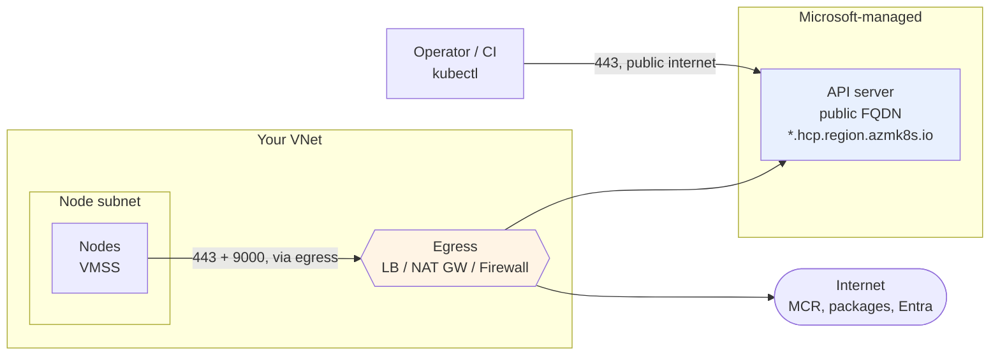
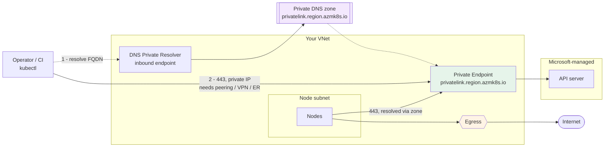
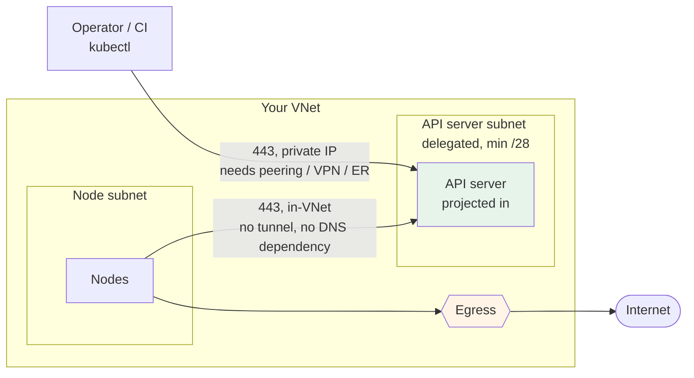
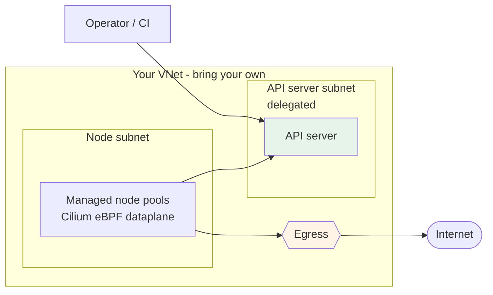
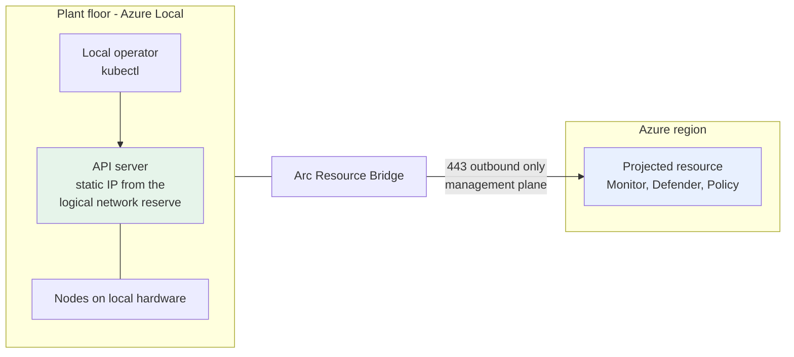
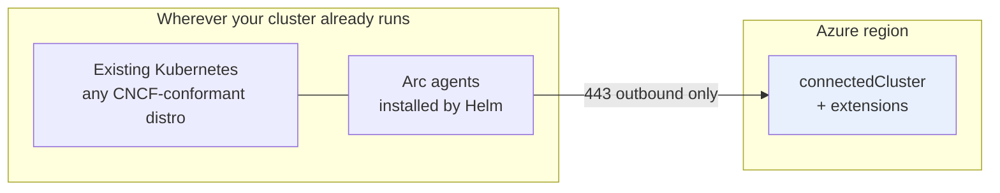

# Networking

The network path is the part of an AKS build that fails, and it fails late. A cluster with a wrong
route or a missing DNS link does not fail at validation — it provisions for fifteen to twenty
minutes and then returns `VMExtensionProvisioningError`, which tells you nothing.

This document describes the data path for each architecture, the address plan, and the exact endpoints
node bootstrap requires. [scripts/preflight.sh](../scripts/preflight.sh) verifies all of it before a
cluster is created.

---

## 1. Data paths

### aks-public and aks-public-authorized-ip



The API server has a public IP. `aks-public` accepts any caller; `aks-public-authorized-ip` accepts
only `authorizedIpRanges`.

**The failure everyone hits:** nodes reach their own API server *through the cluster egress IP*, not
from inside the VNet. Set an allowlist without that IP and the nodes are refused by the control
plane they are trying to join. This template appends the egress IP automatically when egress is
`natgateway` or `udr-firewall`. With `loadbalancer` the egress IP is not knowable in advance, which
is why that combination is discouraged for this architecture.

---

### aks-private-link



Two independent requirements, and people reliably satisfy only the first:

1. **IP reachability** to the private endpoint — same VNet, peering, ExpressRoute or VPN.
2. **DNS resolution** of the private FQDN from wherever `kubectl` runs. Either the private DNS zone
   is linked to that VNet, or a resolver in a linked VNet is the conditional-forward target for
   `privatelink.<region>.azmk8s.io`.

Miss the second and `kubectl` fails with a name-resolution error while the network path is fine.
Pre-flight check `dns.zoneLinked` tests this specifically. `additionalVnetIdsToLink` links hub or on-premises-facing
VNets to the zone; `dnsForwardingRules` configures the resolver for the reverse direction.

---

### aks-private-vnet-integration



The API server is injected into a delegated subnet in your VNet. No Private Endpoint, no private DNS
zone for the API server, no tunnel component on the nodes.

This removes the entire DNS class of failure and lowers API latency. The subnet must be delegated to
`Microsoft.ContainerService/managedClusters` and must not be shared — this template creates and
delegates it. **Prefer this architecture for new private clusters.**

---

### aks-automatic



Same path as VNet integration — Automatic hard-wires it, along with Azure CNI Overlay powered by
Cilium. Node resource group lockdown prevents VNet links on the platform-managed private DNS zone, so
a private Automatic cluster needs a bring-your-own zone.

---

### aks-arc-local



The data path never leaves the building. Azure carries management traffic only, outbound on 443, and
the cluster keeps serving workloads when that link drops. `networkProfile` and `egress` are `none`
because VNets, NAT Gateways and Azure CNI modes are Azure-region constructs that do not exist here.

---

### arc-attach-existing



No cluster is created and no network is built. Onboarding is client-side because
`az connectedk8s connect` needs your kubeconfig, which Resource Manager has no path to — see
[scripts/arc-onboard.sh](../scripts/arc-onboard.sh). Only outbound 443 from the cluster is required.

---

## 2. Address plan

Every range lives in the `addressing` object. Sizes below are what the parameter files ship with.

| Range | Default size | Sizing rule |
| --- | --- | --- |
| `vnetAddressSpace` | /16 | Must not overlap any peered VNet or on-premises range. |
| `nodeSubnetPrefix` | /22 | 1019 usable. Size for max nodes **plus upgrade surge**. |
| `systemNodeSubnetPrefix` | /26 | Minimum /26. `aks-automatic` only, where it is required: it holds the managed system node pool. |
| `podSubnetPrefix` | /21 | Only for `cni-podsubnet`. Needs `nodes × maxPods` addresses. |
| `apiServerSubnetPrefix` | /28 | Minimum /28. Delegated, not shared. VNet-integration architectures only. |
| `firewallSubnetPrefix` | /26 | Azure requires /26 or larger. `udr-firewall` only. |
| `bastionSubnetPrefix` | /26 | Azure requires /26 or larger. |
| `privateEndpointSubnetPrefix` | /27 | One address per private endpoint. |
| `dnsResolverInboundPrefix` | /28 | Minimum /28, delegated to `Microsoft.Network/dnsResolvers`. |
| `dnsResolverOutboundPrefix` | /28 | Same. |
| `serviceCidr` | /16 | **Must not overlap** the VNet, any peered VNet, or on-premises. |
| `dnsServiceIp` | single IP | Must sit inside `serviceCidr` and must not be the network address. |
| `podCidr` | /16 | Overlay only. Same non-overlap rule. |

`serviceCidr` and `podCidr` are **not** VNet-routable when using overlay, but they must still not
collide with anything the cluster needs to reach. A `serviceCidr` that overlaps an on-premises range
means pods resolve that range to a cluster service and the traffic never leaves. This is the single
most common silent failure in enterprise AKS, and it is unfixable after creation because both values
are immutable.

Declare on-premises and peered ranges in `addressing.onPremisesCidrs` (or pass `--on-premises-cidr`
to pre-flight, repeatable). Pre-flight check `cidr.subnetOverlap` fails the deployment on any overlap.

---

## 3. Required outbound endpoints

Node bootstrap fails without these. With `udr-firewall` they are opened by
[infra/modules/firewall/firewall.bicep](../infra/modules/firewall/firewall.bicep); with any other
egress mode they must not be blocked by an NSG or an upstream appliance.

### Network rules

| Destination | Port | Purpose |
| --- | --- | --- |
| `AzureCloud.<region>` service tag | TCP 443 | Azure control plane and regional services. Scoped to the cluster region, not all of Azure. |
| `AzureCloud.<region>` service tag | TCP 9000 | Tunnel front / konnectivity. |
| Any | TCP+UDP 53 | DNS. |
| Any | **UDP 123** | NTP. Clock skew breaks TLS and certificate validation, and the resulting errors never mention time. |

### Application rules

The `AzureKubernetesService` FQDN tag covers the moving core of the list — Microsoft maintains it, so
it does not go stale the way a hand-copied FQDN list does. On top of it:

| FQDN | Why |
| --- | --- |
| `*.hcp.<region>.azmk8s.io` | The API server itself. |
| `mcr.microsoft.com`, `*.data.mcr.microsoft.com` | System container images. |
| `management.azure.com` | ARM. |
| `login.microsoftonline.com` | Entra token acquisition. |
| `packages.microsoft.com` | Azure Linux packages, Moby, kubectl. |
| `packages.aks.azure.com` | Node binaries. AgentBaker's preferred source. |
| `acs-mirror.azureedge.net` | **Fallback** for the above. AgentBaker uses it only when `https://packages.aks.azure.com/acs-mirror/healthz` does not return 200 — so allowlist **both**, or bootstrap fails intermittently and only during an outage. |
| `security.ubuntu.com`, `azure.archive.ubuntu.com`, `changelogs.ubuntu.com`, `motd.ubuntu.com` | Ubuntu security updates. Opened when `osSku=Ubuntu`. |
| `azurelinuxsupport.azureedge.net` | Azure Linux updates. Opened when `osSku=AzureLinux`. |
| `*.ods.opinsights.azure.com`, `*.oms.opinsights.azure.com`, `*.monitoring.azure.com`, `*.handler.control.monitor.azure.com`, `dc.services.visualstudio.com` | Container Insights, Managed Prometheus, Defender. |
| `github.com`, `api.github.com`, `codeload.github.com`, `objects.githubusercontent.com`, `ghcr.io`, `*.pkg.github.com` | Flux, when `allowFluxGitEndpoints=true`. |
| `kubernetes.github.io`, `registry.k8s.io`, `*.pkg.dev` | What the sample tree in [clusters/](../clusters) actually pulls. Without these Flux reconciles cleanly and every pod sits in `ImagePullBackOff` — which looks like a workload bug and is a firewall rule. Mirror into ACR for production and drop them. |

Add anything else your workload needs through `additionalAllowedFqdns`.

---

## 4. Routing with udr-firewall

`outboundType=userDefinedRouting` means AKS creates **no** outbound path. You own it entirely, and
the route table must be correct *before* the nodes boot, because the very first thing they do is
download their bootstrap payload.

The route table this repo builds sends `0.0.0.0/0` to the firewall's private IP. Two things go wrong
in practice:

- **The route is missing or points somewhere else.** Nodes cannot reach anything; CSE exits in the
  50s. Pre-flight check `path.effectiveRoutes` reads the effective routes on the probe VM NIC and flags any unintended
  `0.0.0.0/0` next hop before you deploy.
- **`firewallBypassCidrs` is set on a VNet with no gateway.** Those ranges are routed to a virtual
  network gateway that does not exist, and the traffic black-holes. Only set them when the VNet
  genuinely holds an ExpressRoute or VPN gateway.

`main.bicep` also asserts that the firewall private IP it computed matches the one the firewall
actually got, and surfaces both as outputs (`expectedFirewallPrivateIp`, `actualFirewallPrivateIp`).

Asymmetric routing is the other classic: if you add a route for the API server's public IP that
bypasses the firewall while return traffic comes back through it, the connection is dropped
silently. Do not add per-endpoint routes; let the default route carry everything.

---

## 5. DNS

| Zone | Created for |
| --- | --- |
| `privatelink.<region>.azmk8s.io` | `aks-private-link` |
| `privatelink.azurecr.io` | ACR private endpoint |
| `privatelink.vaultcore.azure.net` | Key Vault private endpoint |
| `privatelink.blob.core.windows.net` | Storage private endpoint |

All are linked to the cluster VNet automatically. Link others with `additionalVnetIdsToLink`.

The **Azure DNS Private Resolver** is deployed when `features.privateDnsResolver` is true. Its
inbound endpoint gives on-premises DNS servers a target to forward Azure private zones to; its
outbound endpoint plus `dnsForwardingRules` sends specified suffixes to your on-premises resolvers.
This is what makes a private cluster usable from a plant network without hand-maintained hosts files.

With `udr-firewall`, the firewall runs as a DNS proxy (`enableDnsProxy=true`). That is what makes
FQDN filtering work in network rules and gives you one place to audit egress name resolution.

---

## 6. What pre-flight actually checks

Run standalone at any time:

```bash
./scripts/preflight.sh --architecture aks-private-link -g rg-aks-prod \
  --node-subnet-id /subscriptions/.../subnets/snet-nodes \
  --on-premises-cidr 10.10.0.0/16
```

| # | Check | Catches |
| --- | --- | --- |
| 1 | Deploys a throwaway Linux VM in the intended node subnet | The real path, not a theoretical one |
| 2 | TCP 443 to every required endpoint, plus UDP 123 | Blocked FQDNs, missing firewall rules, broken proxy |
| 3 | Network Watcher effective routes on the VM NIC | Wrong or missing `0.0.0.0/0` next hop |
| 4 | Network Watcher IP flow verify, outbound 443 | NSG denies |
| 5 | Service/Pod CIDR vs VNet, peered VNets, on-premises | Overlaps that are immutable after creation |
| 6 | Regional vCPU quota for the chosen SKU and count | Quota failures at minute 12 |
| 7 | Private DNS zone linked to / forwarded from the operator's network | `kubectl` name resolution failures on private clusters |
| 8 | Machine-readable JSON + human table, non-zero exit on failure, VM deleted afterwards | — |

`--skip-live-probe` runs the static checks only (CIDR, quota, routes, DNS) without creating a VM.
Useful in a `--preview` pipeline where nothing will be deployed anyway.

A **SKIP** is not a pass. It means that check never ran — most often because a required parameter was
absent — and the corresponding failure mode is still live.
